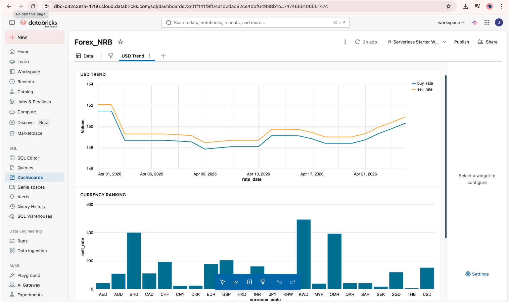

#  Nepal Forex Lakehouse Platform

##  Project Overview
This project builds a complete data engineering pipeline using Nepal Rastra Bank (NRB) Forex API.

## Architecture
NRB API → Bronze → Silver → Gold → Dashboard

## Tech Stack
- Databricks
- PySpark
- Delta Lake
- SQL

Features
- API data ingestion
- Data cleaning and transformation
- Star schema modeling
- Spread and currency analytics
- Daily change detection
- Dashboard visualization

##  Screenshots

##  Project Structure
- notebooks/: PySpark ETL code
- sql/: analytical queries
- screenshots/: project visuals

## Use Case
Provides insights into Nepal forex trends, currency comparison, and volatility analysis.# Nepal-forex-lakehouse-platform
# Nepal-forex-lakehouse-platform
